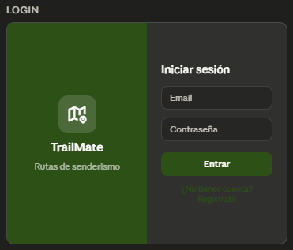
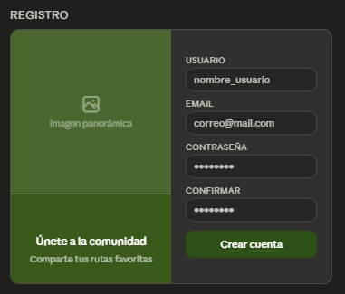
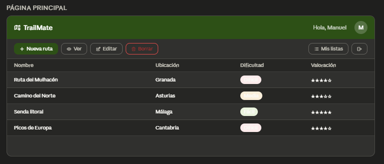
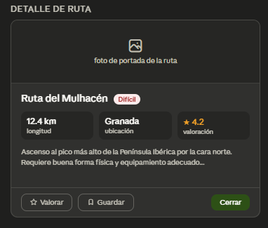
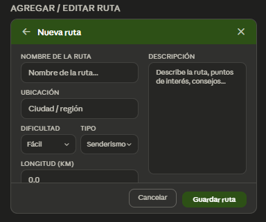
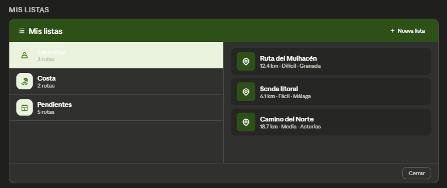
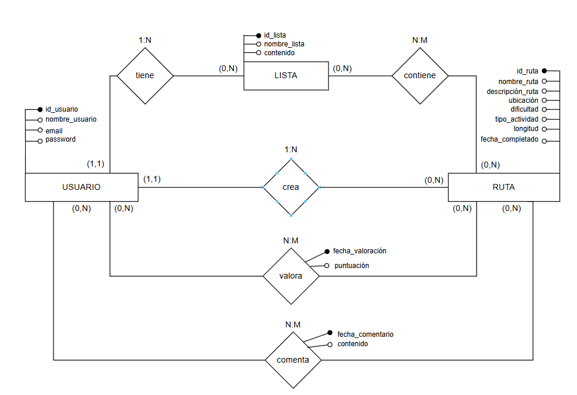
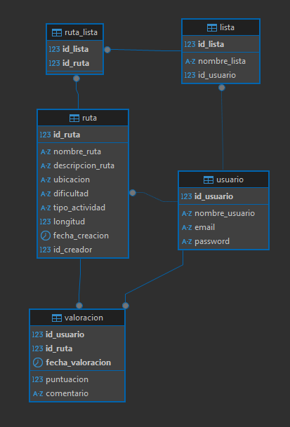
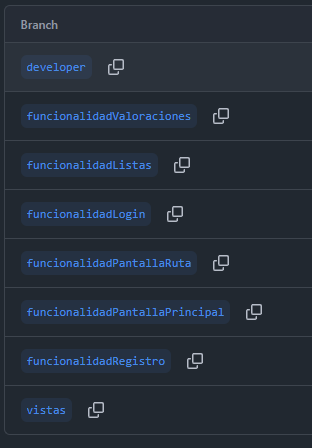

<div style="page-break-after: always; text-align: center; padding-top: 120px;">


# TrailMate

**Proyecto de Acceso a Datos**

---

**Manuel Infantes Rodríguez**

2º DAM

</div>

---

<div style="page-break-after: always;">

## Índice

1. [Introducción](#1-introducción)
   - [a. Definición del problema](#a-definición-del-problema)
2. [Especificación de Diseño](#3-especificación-de-diseño)
   - [a. Wireframes](#ii-wireframes-o-prototipos-de-interfaz)
   - [b. Modelo ER](#i-modelo-entidad-relación-er)
   - [c. Modelo relacional](#ii-modelo-relacional-de-la-base-de-datos)
3. [Planificación y Control de versiones](#4-planificación-y-gestión-del-proyecto)
4. [Implementación](#5-implementación)
   - [a. Estructura del proyecto](#a-estructura-y-organización-del-proyecto)
   - [b. Funcionamiento básico](#b-explicación-del-funcionamiento-básico-de-la-aplicación)
   - [c. Diseño de datos](#c-implementación-del-diseño-de-datos)

</div>

---

## 1. Introducción

### a. Definición del problema

TrailMate es una plataforma de senderismo pensada para los amantes de la montaña y la naturaleza. Permite a sus usuarios descubrir rutas de otros senderistas, publicar las suyas propias, organizarlas en listas personalizadas y dejar valoraciones que ayuden al resto de la comunidad a elegir bien su próxima aventura.

El perfil de usuario objetivo son personas con interés en el senderismo, el ciclismo de montaña o la escalada — tanto quienes dan sus primeros pasos como quienes tienen ya experiencia — que buscan una herramienta práctica y sin fricciones para organizar sus salidas al aire libre. A diferencia de otras aplicaciones del sector, TrailMate apuesta por la sencillez: una interfaz directa, sin anuncios ni funciones innecesarias, centrada en lo esencial.

En futuras versiones, la plataforma podría incorporar integración con mapas interactivos, seguimiento GPS en tiempo real, comunidades organizadas por zona geográfica y sincronización entre dispositivos.

---

## 3. Especificación de Diseño

### a. Diseño funcional del sistema

#### ii. Wireframes o prototipos de interfaz

Los siguientes wireframes representan las pantallas de la aplicación.

---

**Login**



Pantalla de inicio de sesión. El usuario introduce su email y contraseña. Si los datos son correctos accede a la página principal; si no existe cuenta, puede navegar al registro mediante el enlace inferior.

---

**Registro**



Formulario de creación de cuenta. El usuario introduce nombre de usuario, email, contraseña y confirmación de contraseña. Al pulsar "Crear cuenta" se validan los datos y se registra el usuario en la base de datos.

---

**Página Principal**



Vista central de la aplicación. Muestra una tabla con todas las rutas disponibles (nombre, ubicación, dificultad y valoración media). Desde aquí el usuario puede crear una nueva ruta, ver el detalle, editarla, borrarla o acceder a sus listas. También se muestra el nombre del usuario autenticado.

---

**Detalle de Ruta**



Muestra la información completa de una ruta seleccionada: nombre, dificultad, longitud, ubicación, valoración media y descripción. Permite al usuario valorar la ruta o guardarla en una de sus listas.

---

**Agregar / Editar Ruta**



Formulario reutilizable para crear una nueva ruta o editar una existente. Recoge nombre, ubicación, dificultad (combo), tipo de actividad (combo), longitud en km y descripción. El título del formulario cambia según la acción ("Nueva ruta" o "Editar ruta").

---

**Mis Listas**



Pantalla de gestión de listas personales. A la izquierda aparece la lista de colecciones del usuario (con el número de rutas que contiene cada una). Al seleccionar una, el panel derecho muestra las rutas que pertenecen a esa lista. Se puede crear una nueva lista, eliminar una existente o quitar una ruta de la lista.

---

### b. Diseño de datos

#### i. Modelo entidad-relación (ER)



El modelo ER refleja las siguientes entidades y relaciones:

**crea** (USUARIO → RUTA, 1:N)
- Participación de USUARIO: (0,N) — un usuario puede no haber creado ninguna ruta o haber creado varias. Participación parcial.
- Participación de RUTA: (1,1) — toda ruta tiene exactamente un creador. Participación total.

**tiene** (USUARIO → LISTA, 1:N)
- Participación de USUARIO: (0,N) — un usuario puede no tener ninguna lista o tener varias. Participación parcial.
- Participación de LISTA: (1,1) — toda lista pertenece a exactamente un usuario. Participación total.

**contiene** (LISTA ↔ RUTA, N:M)
- Participación de LISTA: (0,N) — una lista puede estar vacía o contener varias rutas. Participación parcial.
- Participación de RUTA: (0,N) — una ruta puede no estar en ninguna lista o estar en varias. Participación parcial.
- Se resuelve con la tabla intermedia `RUTA_LISTA`.

**valora** (USUARIO ↔ RUTA, N:M)
- Participación de USUARIO: (0,N) — un usuario puede no haber valorado ninguna ruta o haber valorado varias. Participación parcial.
- Participación de RUTA: (0,N) — una ruta puede no tener valoraciones o tener varias. Participación parcial.
- Atributos de la relación: `fecha_valoracion` (identificador de la valoración) y `puntuacion`.

**comenta** (USUARIO ↔ RUTA, N:M)
- Participación de USUARIO: (0,N) — un usuario puede no haber comentado ninguna ruta o haber comentado varias. Participación parcial.
- Participación de RUTA: (0,N) — una ruta puede no tener comentarios o tener varios. Participación parcial.
- Atributos de la relación: `fecha_comentario` (identificador) y `contenido`.

#### ii. Modelo relacional de la base de datos



El modelo relacional resultante contiene las siguientes tablas:

- `USUARIO (id_usuario PK, nombre_usuario, email, password)`
- `RUTA (id_ruta PK, nombre_ruta, descripcion_ruta, ubicacion, dificultad, tipo_actividad, longitud, fecha_creacion, id_creador FK→USUARIO)`
- `LISTA (id_lista PK, nombre_lista, id_usuario FK→USUARIO)`
- `RUTA_LISTA (id_lista FK, id_ruta FK)` — clave primaria compuesta, relación N:M entre LISTA y RUTA
- `VALORACION (id_usuario FK, id_ruta FK, fecha_valoracion, puntuacion, comentario)` — clave primaria compuesta (id_usuario, id_ruta, fecha_valoracion)

Todas las claves foráneas tienen `ON DELETE CASCADE`.

---

## 4. Planificación y Gestión del Proyecto

### d. Control de versiones

El proyecto usa Git con GitHub como repositorio remoto. Las ramas del proyecto son las siguientes:

| Rama | Contenido |
|------|-----------|
| `main` | Código estable y revisado |
| `developer` | Integración de todas las funcionalidades |
| `vistas` | Diseño de las pantallas de la aplicación (Swing) |
| `funcionalidadRegistro` | Registro de nuevos usuarios |
| `funcionalidadLogin` | Autenticación y gestión de sesión |
| `funcionalidadPantallaPrincipal` | Listado, búsqueda y gestión de rutas |
| `funcionalidadPantallaRuta` | Detalle, creación y edición de rutas |
| `funcionalidadListas` | Gestión de listas personales del usuario |
| `funcionalidadValoraciones` | Valoraciones y comentarios sobre rutas |



---

## 5. Implementación

### a. Estructura y organización del proyecto

El proyecto sigue el patrón **MVC (Modelo–Vista–Controlador)** de forma estricta:

```
PROYECTO2ADA/
└── src/main/java/
    ├── Main.java                        ← punto de entrada, lanza la primera vista
    ├── controlador/
    │   ├── ControladorLogin.java
    │   ├── ControladorRegistro.java
    │   ├── ControladorPrincipal.java
    │   ├── ControladorRuta.java
    │   ├── ControladorAgregarRuta.java
    │   └── ControladorLista.java
    ├── modelo/
    │   └── GestorBD.java               ← toda la lógica de acceso a datos (JDBC)
    ├── vista/
    │   ├── VistaLogin.java / .form
    │   ├── VistaRegistro.java / .form
    │   ├── VistaPaginaPrincipal.java / .form
    │   ├── VistaRuta.java / .form
    │   ├── VistaFormularioRuta.java / .form
    │   └── VistaLista.java / .form
    ├── img/
    │   ├── Wireframes/
    │   └── BBDD/
    └── resources/
        └── BBDD.sql
```

**Regla MVC aplicada:** las vistas solo exponen getters, setters y referencias a botones. No contienen ninguna lógica de negocio ni acceso a datos. Toda la lógica reside en los controladores, que se comunican con `GestorBD` (modelo) para ejecutar las consultas.

### b. Explicación del funcionamiento básico de la aplicación

El flujo de uso de la aplicación es el siguiente:

1. **Arranque:** `Main.java` instancia `VistaLogin` y `ControladorLogin`. El controlador registra los listeners sobre los botones de la vista.
2. **Login:** el usuario introduce email y contraseña. El controlador llama a `GestorBD.validarLogin()`, que ejecuta una consulta preparada. Si el resultado es correcto, se abre `VistaPaginaPrincipal`; si no, se muestra un mensaje de error.
3. **Registro:** desde el login se puede navegar a `VistaRegistro`. El controlador valida que las contraseñas coincidan y llama a `GestorBD.registrarUsuario()`, que inserta el usuario en la BD.
4. **Página principal:** se carga la tabla de rutas con `GestorBD.cargarRutasTabla()`. El usuario puede seleccionar una fila y usar los botones de la barra de herramientas para ver, editar o borrar la ruta seleccionada, o crear una nueva.
5. **Ver ruta:** abre `VistaRuta` con los datos de la ruta seleccionada. Permite valorar la ruta o guardarla en una lista.
6. **Crear / Editar ruta:** abre `VistaFormularioRuta`. Si es edición, los campos se rellenan con los datos existentes. Al guardar, el controlador llama al método correspondiente de `GestorBD` (insert o update).
7. **Mis listas:** abre `VistaLista` con las listas del usuario. Al seleccionar una lista se cargan las rutas que contiene.

### c. Implementación del diseño de datos

La clase `GestorBD` centraliza todo el acceso a la base de datos mediante **JDBC puro**. Utiliza los siguientes mecanismos:

- **Consultas simples** (`Statement`): para lecturas sencillas sin parámetros variables, como cargar todas las rutas.
- **Consultas preparadas** (`PreparedStatement`): para todas las operaciones con datos del usuario (login, registro, insertar/editar ruta, valoraciones), evitando inyección SQL.
- **Procedimientos almacenados** (`CallableStatement`): para operaciones más complejas definidas en la base de datos.
- **Transacciones**: en operaciones que implican varias inserciones relacionadas (por ejemplo, crear una ruta y añadirla a una lista a la vez), se usa `connection.setAutoCommit(false)` con `commit()` y `rollback()` para garantizar la integridad de los datos.

El script `BBDD.sql` crea la base de datos `mvcADA` con todas las tablas y relaciones. Se ejecuta directamente en MySQL antes de arrancar la aplicación.

Además del acceso a datos básico, la base de datos incorpora las siguientes restricciones adicionales:

**Constraints:**

- **`UNIQUE(nombre_usuario)`** en `USUARIO`: el nombre de usuario es único a nivel de base de datos.
- **`UNIQUE(nombre_lista, id_usuario)`** en `LISTA`: un usuario no puede tener dos listas con el mismo nombre.
- **PK compuesta `(id_lista, id_ruta)`** en `RUTA_LISTA`: impide añadir la misma ruta dos veces a la misma lista.
- **`CHECK (puntuacion BETWEEN 1 AND 5)`** en `VALORACION`: la puntuación solo admite valores entre 1 y 5.

**Triggers:**

- **`before_insert_valoracion`:** comprueba dos cosas antes de insertar una valoración: que el usuario no sea el creador de la ruta y que no haya valorado ya esa ruta antes.
- **`before_insert_ruta`:** comprueba que la longitud sea un valor positivo (> 0).
- **`before_update_ruta_creador`:** impide modificar el campo `id_creador` una vez creada la ruta.
- **`before_insert_lista_duplicada`:** lanza un mensaje descriptivo cuando se intenta crear una lista con un nombre que ya existe para ese usuario.

**Procedimientos almacenados:**

- **`calcularMediaValoracion(p_id_ruta)`:** calcula y devuelve la media de puntuaciones de una ruta.
- **`agregarRutaALista(p_id_lista, p_id_ruta, p_id_usuario)`:** verifica que la lista pertenece al usuario antes de insertar en `RUTA_LISTA`.
- **`borrarRutaSiEsCreador(p_id_ruta, p_id_usuario)`:** elimina la ruta solo si el usuario es su creador, y devuelve un código de resultado.
